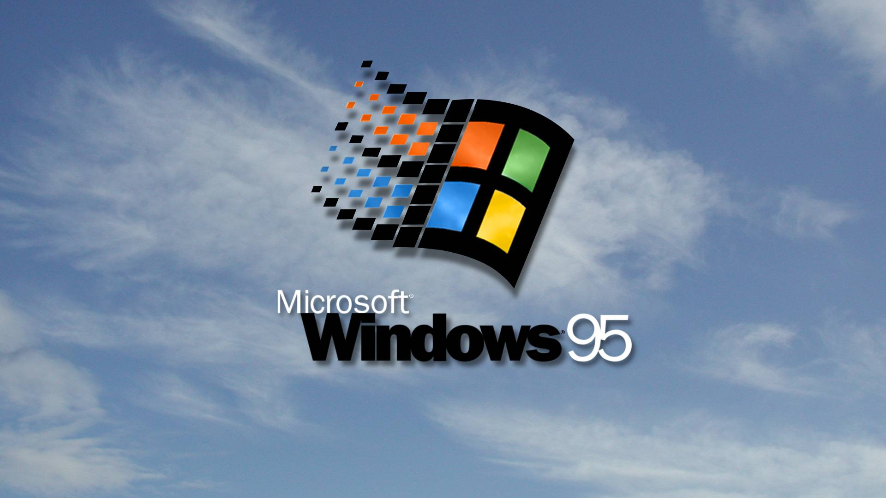

# Genie 95

 
My windows 95 porfolio website built with [React95](https://github.com/React95/React95)

## Components 
- `public/`
- `src/`
    - `components/`
        - Modal/
            - `GenieModal.js`
            - `NotepadModal.js`
            - `VideoModal.js`
        - `Desktop.js`
        - `Taskbar.js`
        - `Shortcuts.js`
        - `Player.js`
        - `ModalManager.js`
    - `context/`
        - `Clippy.js`
        - `DataContext.js`
        - `ModalContext.js`
        - `startWebamp.js`
    - styles
        - `Desktop.css`
    - `App.js`
    - `index.js`

## Credits
- [React](https://github.com/facebook/react)
- [React95](https://github.com/React95/React95)
- [Webamp](https://github.com/captbaritone/webamp)
- [jspaint](https://github.com/1j01/jspaint)